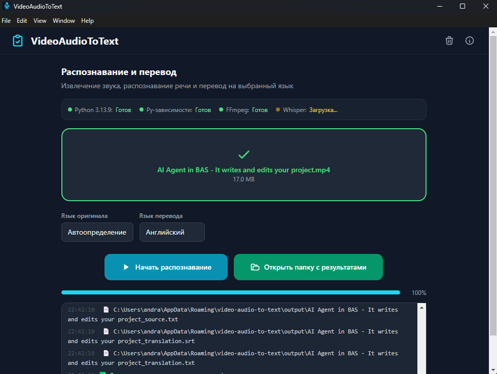

# VideoAudioToText



Извлечение звука из видео/аудио, распознавание речи (Whisper) и перевод (Google Translate).

## Возможности

- 🎬 Поддержка форматов: MP4, AVI, MKV, MOV, WebM, MP3, WAV, M4A, OGG, FLAC, AAC, WMA
- 🎙 Распознавание речи через faster-whisper (CPU, int8)
- 🌐 Перевод через Google Translate (28 языков, по умолчанию — русский)
- 📄 Сохранение 4 файлов: исходный текст (SRT + TXT), перевод (SRT + TXT)
- 🖥 Кроссплатформенный: Windows, macOS, Linux
- ✅ Авто-загрузка модели из кэша при запуске

## Сборка

```bash
npm install
npm run build        # electron-vite build
npm run dist         # Windows .exe
npm run dist:mac     # macOS .dmg
npm run dist:linux   # Linux .AppImage + .deb
npm run dist:all     # Все платформы
```

## CI/CD

GitHub Actions автоматически собирает для всех платформ при пуше тега `v*`:
- Windows: NSIS `.exe`
- macOS Intel + Apple Silicon: `.dmg`
- Linux: `.AppImage` + `.deb`

## Контакты

- Поддержка: [@AndranikFutureLabs](https://t.me/AndranikFutureLabs)
- Канал: [@AndranikFutureLabsChannel](https://t.me/AndranikFutureLabsChannel)
- Сайт: [andranik-future-labs.ru/software/VideoAudioToText](https://andranik-future-labs.ru/software/VideoAudioToText)
- GitHub: [AndranikFutureLabs/VideoAudioToText](https://github.com/AndranikFutureLabs/VideoAudioToText)

## Лицензия

MIT © AndranikFutureLabs
